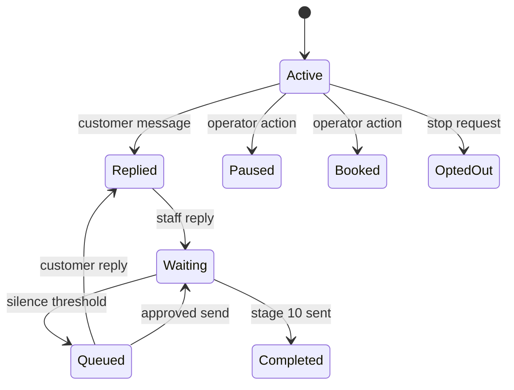

# Architecture and decision rules

## Lead state machine

`current_stage` is the highest recognized follow-up, not the last outbound message. This is what lets a sales conversation happen between follow-ups without restarting or skipping the sequence.

## Send-time invariants

A queue may send only if all are true:

1. Global sending is enabled.
2. The queue is approved, or automatic mode is enabled.
3. Contact status is active, replied, or waiting.
4. Queue stage equals `current_stage + 1`.
5. `last_customer_at` is identical to the value captured when queued.
6. The standard messaging window is still open.
7. The exact stage has not already completed.

The database uniqueness constraints protect message IDs and contact-stage queues. The service also uses Meta webhook event IDs to make retries idempotent.

## Media delivery

Stages 3 and 9 consist of a text message followed by an image. The queue stores each returned Meta message ID independently. If the image call fails after text succeeds, a retry sees `text_message_id` and sends only the image.

## Security boundaries

- Meta OAuth: signed, expiring state values prevent login CSRF. Meta access tokens are exchanged server-side and encrypted with AES-256-GCM before database storage.
- OAuth account selection: Page tokens travel back to the server only inside an authenticated encrypted bundle with a 15-minute expiry.
- Meta webhook: verified using the raw request body and `X-Hub-Signature-256`.
- Meta data deletion: signed requests are verified with the App Secret before stored tokens are invalidated.
- n8n scheduler: authenticated with `x-internal-token`.
- Admin interface: HTTP Basic Authentication plus a form token.
- Supabase: service-role access from the server only; RLS blocks unauthenticated table access.
- Media: intentionally public and restricted to two allowlisted filenames.
