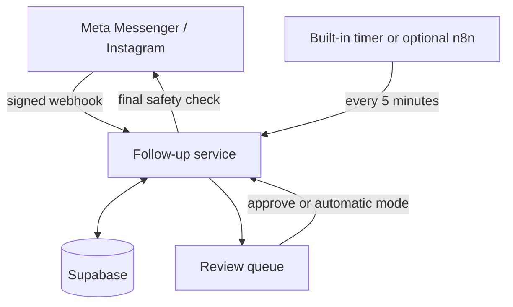

# MaidThis Meta Follow-up Automation

A complete, policy-aware follow-up system for Facebook Messenger and Instagram conversations generated by Meta ads. It remembers the highest MaidThis follow-up stage sent, ignores ordinary conversation when calculating the stage, pauses whenever a customer replies, resumes at the next stage after the sales conversation goes quiet, and prevents duplicate sends.

The project starts with global sending **paused** and **review mode enabled**. No outbound message can send until an administrator enables sending.

## What is included

- The exact 10-stage MaidThis sequence from the supplied template
- Skeleton and Mr. Bean media from the supplied PDF
- Deterministic matching of manually sent saved replies
- Existing-conversation history import through Meta's Conversations API
- Customer-reply cancellation and automatic resumption from the next stage
- Per-lead daily limits, minimum gaps, business hours, and a global pause
- Review queue with Approve, Send now, Skip stage, Pause, Booked, and Opt-out controls
- Meta webhook signature verification and webhook-event deduplication
- Final pre-send checks for replies, stage changes, booking/opt-out state, duplicate stages, and Meta's standard messaging window
- Partial-send recovery for text-plus-image stages
- Facebook Messenger and Instagram webhook handling
- Supabase schema, Docker image, built-in scheduler, optional n8n workflows, and dependency-free Node.js tests

## System map



Business logic and scheduling live in the service instead of inside a fragile browser macro. n8n is included only as an optional external scheduler.

## Safety behavior

1. A normal outbound sales reply updates activity but does not change `current_stage`.
2. A known follow-up template changes `current_stage` to the highest detected stage.
3. An incoming customer message cancels every pending or approved follow-up immediately.
4. A new follow-up is queued only after the Page has replied to the customer's latest message and the configured silence period passes.
5. Before sending, the system re-reads the lead and refuses to send if anything changed.
6. The service does not use `HUMAN_AGENT` or another message tag to automate promotional follow-ups.
7. Outside the configured standard window, the queue becomes `blocked_policy`. This is deliberate. Five-day automated re-engagement requires a Meta-approved out-of-window product and contact eligibility. Do not bypass that restriction with a browser bot.

## Setup

### 1. Create Supabase

1. Create a Supabase project.
2. Open **SQL Editor**.
3. Run `sql/001_schema.sql`.
4. Run `sql/002_seed_templates.sql`.
5. In **Settings > API Keys**, create a new `sb_secret_...` secret key. Keep it server-side only. The publishable key is not used by this backend.

### 2. Create the Meta app

1. In Meta for Developers, create a Business app or open the app connected to the MaidThis Page.
2. Add the Messenger product and connect the Facebook Page. For Instagram, connect the Professional Instagram account to the Page and enable Instagram messaging for the same app.
3. Generate a Page access token with the permissions Meta currently requests for messaging and conversation-history access. App Review and Advanced Access may be required before using non-role accounts.
4. Subscribe the app to message webhook fields, including `messages`, `message_echoes`, `messaging_postbacks`, and any messaging referral field you use for ads. Echoes are required to recognize saved replies sent manually in Business Suite.
5. Record the App Secret, Page or Instagram business account ID, and Page access token.

Meta changes permission names, API versions, and review screens over time. Use the current version shown in your Meta app dashboard. `META_GRAPH_VERSION` is configurable so no code change is needed.

### 3. Configure the service

Copy `.env.example` to `.env`, then set every value. Generate long random values for the admin password and three tokens. Example:

```bash
cp .env.example .env
openssl rand -hex 32
```

Important values:

| Variable | Meaning |
|---|---|
| `PUBLIC_BASE_URL` | Public HTTPS origin of this app, with no trailing slash |
| `SUPABASE_SECRET_KEY` | New Supabase `sb_secret_...` backend key, never a publishable key |
| `META_VERIFY_TOKEN` | Random value you also enter in Meta's webhook screen |
| `META_APP_SECRET` | Used to verify every webhook signature |
| `META_PAGE_ACCESS_TOKEN` | Token used to read conversations and send messages |
| `META_BUSINESS_ACCOUNT_ID` | Facebook Page ID or Instagram business account ID used by backfill |
| `META_PLATFORM` | `messenger` or `instagram` for the backfill button |

For several Pages/accounts, put their tokens in `META_ACCESS_TOKENS_JSON`. The webhook's account ID selects the correct token.

### 4. Deploy with Docker

On a server with Docker and a public HTTPS hostname:

```bash
docker compose up -d --build app
docker compose ps
curl https://YOUR_HOST/healthz
```

Put Caddy, Nginx, Cloudflare Tunnel, Render, Railway, Fly.io, or another HTTPS proxy in front of port 3000. The public `/media/skeleton.jpg` and `/media/mr-bean.png` URLs must load without authentication because Meta retrieves them when sending attachments. Keep `/admin` protected by its configured Basic Authentication. The service includes its own five-minute scheduler, so n8n is not required.

If using a managed Node host instead of Docker, run Node 22 or newer and use `npm start`. The app has no production npm dependencies.

### 5. Connect Meta webhooks

In the Meta app webhook settings enter:

- Callback URL: `https://YOUR_HOST/webhooks/meta`
- Verify token: the exact value of `META_VERIFY_TOKEN`

Complete verification, subscribe the connected Page/account, and send a test message. The service validates `X-Hub-Signature-256`; unsigned or incorrectly signed requests are rejected.

### 6. Optional: use n8n instead of the built-in scheduler

1. Set `INTERNAL_SCHEDULER_ENABLED=false` on the app.
2. Deploy n8n with `docker compose up -d n8n` and open it at port 5678 or its HTTPS hostname.
3. Add environment variables to the n8n service:
   - `FOLLOWUP_APP_URL=https://YOUR_HOST`
   - `FOLLOWUP_INTERNAL_TOKEN=` the same value as `INTERNAL_TOKEN`
4. Import `n8n/workflows/MaidThis-Followup-Scheduler.json`.
5. Import `n8n/workflows/MaidThis-Daily-Safety-Report.json` if you want a daily data source for Slack/email reporting.
6. Activate the scheduler workflow only after the next section is complete.

The safety-report workflow only retrieves JSON. Connect its final node to your preferred Slack or email node if desired.

### 7. Safe rollout

1. Open `https://YOUR_HOST/admin` and sign in.
2. Leave **Global sending = Paused** and **Mode = Review required**.
3. Click **Import existing Meta history** once. This scans known messages, detects the highest template stage in each conversation, and stores the messages idempotently.
4. Spot-check at least 20 conversations against Business Suite, especially stages 3, 7, and 9.
5. Allow the built-in scheduler to build the review queue. Sending remains paused.
6. Set **Global sending = Enabled** while keeping **Review required** selected.
7. Approve individual follow-ups for several days. Confirm replies cancel pending items and manual saved replies advance the correct stage.
8. When the decisions are consistently correct, change **Mode = Automatic**.

Recommended initial controls:

- Follow-ups per day: `2`
- Minimum gap: `240` minutes
- Silence before queueing: `180` minutes
- Business hours: `9:00 AM` to `7:00 PM` America/Los_Angeles

Business hours and the standard messaging window are stored in `automation_settings`. Edit them in Supabase if you need values not yet exposed on the dashboard.

### 8. Test before production

```bash
npm test
npm run check
```

Use a Meta test Page/account first. Verify this exact checklist:

- Incoming reply cancels a pending and an approved follow-up.
- Ordinary staff conversation does not advance the stage.
- A manually sent saved reply advances the matching stage.
- The scheduler proposes exactly `current_stage + 1`.
- Booked, paused, opted-out, and completed contacts never send.
- A follow-up outside the standard window becomes `blocked_policy`.
- Skeleton and Mr. Bean images load publicly over HTTPS.
- Retrying a partial media failure sends only the missing part.

## Operations

- Emergency stop: set **Global sending = Paused** in `/admin`.
- Lead stop: mark the contact `paused`, `booked`, or `opted_out`.
- Skip one message: use **Skip stage**. The stage advances without sending.
- Recover a failed queue: inspect `last_error`, resolve the credential/media issue, then approve it again in Supabase or create a replacement after clearing the failed row.
- Backups: enable Supabase backups and keep the SQL migration files in source control.
- Logs: ship container stdout/stderr to your normal logging service. Never log access tokens.

## Current scope

This release automates only messages that Meta allows through the standard Send API window. It intentionally does not automate out-of-window promotional messages. If MaidThis's Page receives access to Meta Marketing Messages or another approved product, implement it as a separate delivery adapter with explicit opt-in/eligibility fields; do not loosen `standard_window_hours` to pretend that eligibility exists.

The dashboard is an internal operations tool, not a multi-tenant SaaS product. Put it behind HTTPS, use a strong password, and restrict it by VPN or IP allowlist when possible.
